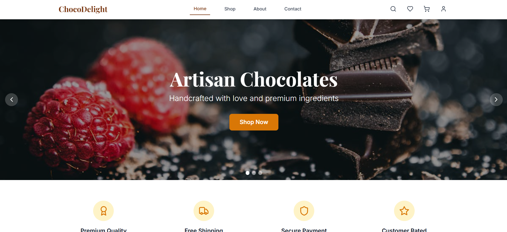
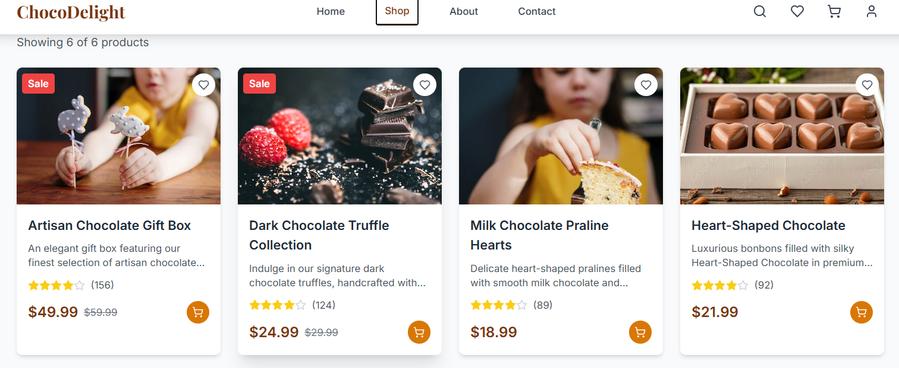
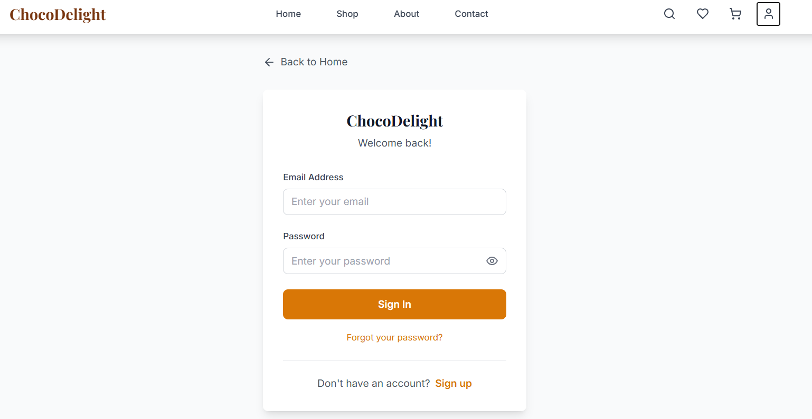

# ChocoDelight - Premium Chocolate Shop E-commerce Website

A full-stack e-commerce application for a premium chocolate shop built with React, Node.js, Express, and MongoDB.


### 🏠 Homepage


### 🛍️ Product Page


### 🛠️ Admin Dashboard



## 🍫 Features

### Frontend Features
- **Responsive Design**: Beautiful, mobile-first design with chocolate-inspired aesthetics
- **Product Catalog**: Browse products with advanced filtering, sorting, and search
- **Shopping Cart**: Add/remove items, update quantities, persistent cart storage
- **User Authentication**: Secure login/signup with JWT tokens
- **User Profiles**: Order history, favorites, personal information management
- **Product Details**: High-quality images, detailed descriptions, customer reviews
- **Checkout Process**: Multi-step checkout with order confirmation
- **Admin Dashboard**: Product management, customer management, order tracking

### Backend Features
- **MongoDB Integration**: Secure data storage with Mongoose ODM
- **JWT Authentication**: Secure user authentication and authorization
- **Role-based Access**: Customer and Admin roles with different permissions
- **Email Integration**: OTP-based password reset functionality
- **Order Management**: Real-time order tracking and status updates
- **Inventory Management**: Stock tracking and automatic updates
- **Security**: Password hashing, input validation, CORS protection

## 🚀 Quick Start

### Prerequisites
- Node.js (v14 or higher)
- MongoDB (local installation or MongoDB Atlas account)
- Git

### Installation

1. **Clone the repository**
   ```bash
   git clone https://github.com/Abhi76076/ChocoDlight.git
   cd chocolate-shop
   ```

2. **Install dependencies**
   ```bash
   npm install
   ```

3. **For Start the server and application with in one cmd in root directory of project open terminal and run these cmd.**
   ```bash
   npm install concurrently --save-dev
   npm install nodemon --save-dev
   ```

4. **Set up environment variables**
   - Copy `.env.example` to `.env`
   - Update the following variables in `.env`:
   ```env
   MONGODB_URI=mongodb://localhost:27017/chocolate-shop
   JWT_SECRET=your-super-secret-jwt-key
   EMAIL_HOST=smtp.gmail.com
   EMAIL_USER=your-email@gmail.com
   EMAIL_PASS=your-app-password
   EMAIL_PORT=587
   VITE_API_URL=http://localhost:5000/api
   ```

5. **Start MongoDB**
   - **Local MongoDB**: Make sure MongoDB is running on your system
   - **MongoDB Atlas**: Use the connection string from your Atlas cluster

6. **Run the application**
   ```bash
   npm run dev
   ```
   This command starts both the backend server (port 5000) and frontend development server (port 5173).

7. **Access the application**
   - Frontend: http://localhost:5173
   - Backend API: http://localhost:5000

## 📁 Project Structure

```
chocolate-shop/
|___screenshots           #for screenshots of the project
|   |_homepage.png
|   |_items.png
|   |_loginpage.png
|
├── server/                 # Backend application
│   ├── config/            # Database configuration
│   ├── middleware/        # Authentication middleware
│   ├── models/           # MongoDB models
│   ├── routes/           # API routes
│   ├── utils/            # Utility functions
│   └── server.js         # Express server setup
├── src/                  # Frontend application
│   ├── components/       # Reusable React components
│   ├── contexts/         # React context providers
│   ├── data/            # Static data and mock data
│   ├── pages/           # Page components
│   ├── services/        # API service layer
│   └── types/           # TypeScript type definitions
├── public/              # Static assets
└── package.json         # Project dependencies and scripts
|___env.example          #environment setup for backend database
```

## 🛠️ Available Scripts

### Development
- `npm run dev` - Run both frontend and backend in development mode
- `npm run server:dev` - Run only backend server with nodemon
- `npm run server` - Run backend server in production mode

### Build & Deploy
- `npm run build` - Build frontend for production
- `npm run preview` - Preview production build locally
- `npm run lint` - Run ESLint for code quality

## 🔧 Configuration

### Database Setup

#### Local MongoDB
1. Install MongoDB on your system
2. Start MongoDB service
3. Use connection string: `mongodb://localhost:27017/chocolate-shop`

#### MongoDB Atlas (Cloud)
1. Create account at https://www.mongodb.com/atlas
2. Create a new cluster
3. Get connection string from Atlas dashboard
4. Update `MONGODB_URI` in `.env` file

### Email Configuration (for OTP)
1. **Gmail Setup**:
   - Enable 2-factor authentication
   - Generate App Password in Google Account settings
   - Use App Password as `EMAIL_PASS` in `.env`

2. **Other Email Providers**:
   - Update SMTP settings in `server/utils/email.js`
   - Configure appropriate credentials in `.env`

## 👤 User Roles

### Customer Features
- Browse and search products
- Add items to cart and checkout
- View order history and track orders
- Manage favorites and profile
- Cancel orders (within 5 minutes)

### Admin Features
- Access admin dashboard
- Manage products (add, edit, delete)
- View customer information
- Manage orders and update status
- View sales statistics

### Creating Admin User
1. Register as a normal user
2. Update user role in MongoDB:
   ```javascript
   db.users.updateOne(
     { email: "admin@example.com" },
     { $set: { role: "admin" } }
   )
   ```

## 🔐 Security Features

- **Password Security**: Bcrypt hashing with salt rounds
- **JWT Tokens**: Secure authentication with expiration
- **Input Validation**: Server-side validation for all inputs
- **CORS Protection**: Configured for frontend domain
- **Role-based Access**: Protected admin routes
- **Email Verification**: OTP-based password reset

## 🐛 Troubleshooting

### Common Issues

1. **"Failed to fetch" error**
   - Ensure backend server is running (`npm start`)
   - Check MongoDB connection
   - Verify `.env` configuration

2. **MongoDB connection error**
   - Check if MongoDB is running locally
   - Verify connection string in `.env`
   - For Atlas: check network access and credentials

3. **Email OTP not working**
   - Verify email credentials in `.env`
   - For Gmail: use App Password, not regular password
   - Check spam folder for OTP emails

4. **Port conflicts**
   - Frontend runs on port 5173
   - Backend runs on port 5000
   - Change ports in configuration if needed

### Development Tips

- Use browser developer tools to debug frontend issues
- Check server console for backend error messages
- Use MongoDB Compass to inspect database collections
- Enable CORS in browser for development if needed

## 📝 API Documentation

### Authentication Endpoints
- `POST /api/auth/register` - User registration
- `POST /api/auth/login` - User login
- `POST /api/auth/forgot-password` - Request password reset
- `POST /api/auth/reset-password` - Reset password with OTP
- `GET /api/auth/me` - Get current user info

### Product Endpoints
- `GET /api/products` - Get all products
- `GET /api/products/:id` - Get single product
- `POST /api/products` - Create product (admin only)
- `PUT /api/products/:id` - Update product (admin only)
- `DELETE /api/products/:id` - Delete product (admin only)

### Order Endpoints
- `POST /api/orders` - Create new order
- `GET /api/orders/my-orders` - Get user's orders
- `PATCH /api/orders/:id/cancel` - Cancel order
- `GET /api/orders/admin/all` - Get all orders (admin)
- `PATCH /api/orders/admin/:id/status` - Update order status (admin)

## 🤝 Contributing

1. Fork the repository
2. Create feature branch (`git checkout -b feature/amazing-feature`)
3. Commit changes (`git commit -m 'Add amazing feature'`)
4. Push to branch (`git push origin feature/amazing-feature`)
5. Open Pull Request

## 📄 License

This project is licensed under the MIT License - see the LICENSE file for details.

## 🆘 Support

For support and questions:
- Create an issue in the repository
- Check the troubleshooting section above
- Review the API documentation

---

**Happy Coding! 🍫✨**